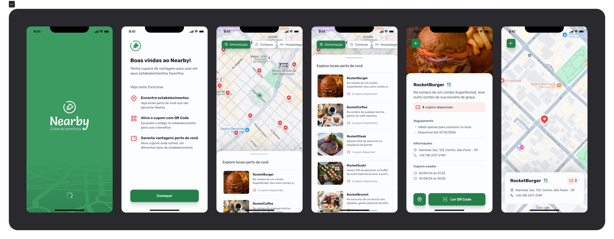

<h1 align="center"> NEARBY </h1>

 

  

## 🚀 Tecnologias

Esse projeto está sendo desenvolvido com as seguintes tecnologias:

 

## Mobile

- Typescript
- Reactnative
- Expo
- axios

## 💻 Projeto

O projeto desenvolvido no NLW Pocket é um aplicativo mobile que permite aos usuários registrar e monitorar suas refeições diárias, categorizando-as como dentro ou fora da dieta.

As principais funcionalidades do aplicativo incluem:

Cadastro de refeições : Permite que o usuário registre suas refeições com detalhes como nome, descrição, dados e hora.

Classificação de refeições : O usuário pode indicar se a refeição está dentro ou fora da dieta adequada.

Resumo estatístico : Exibe estatísticas sobre as refeições, como o percentual de refeições dentro da dieta e a melhor sequência de dias em conformidade com a dieta.

Edição e exclusão de refeições : Funcionalidades para editar ou remover refeições previamente cadastradas.

## Como Executar o Projeto

Clonar este repositório

Instalar as dependências

npm install

expo start

Utilize o aplicativo Expo Go em seu dispositivo móvel ou um emulador para visualizar o aplicativo.